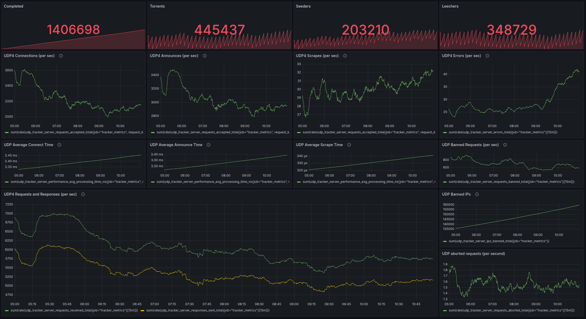

# Torrust Tracker Demo

This repo contains all the configuration needed to run the live Torrust Tracker demo.

It's also used to track issues in production.

> IMPORTANT: We are in the process of [splitting the Torrust Demo repo into
> two repos](https://github.com/torrust/torrust-demo/issues/79). This will
> allow us to deploy both services independently and it would make easier for
> users who only want to setup the tracker to re-use this setup. The content
> of this repo may change drastically in the future.

## Demo tracker

- HTTP Tracker: <https://tracker.torrust-demo.com/announce>
- UDP Tracker: udp://tracker.torrust-demo.com:6969/announce

### Monitoring

The demo includes monitoring with Grafana dashboards for the tracker to track
performance metrics, peer connections, and system health.



## Documentation

### Production Deployment

- [Setup](docs/setup.md)
- [Deployment](docs/deployment.md)
- [Firewall](docs/firewall.md)
- [Sample Commands](docs/sample_commands.md)
- [Rollbacks](docs/rollbacks.md)
- [Backups](docs/backups.md)

### Local Testing Infrastructure

- [Quick Start Guide](docs/infrastructure/quick-start.md) - Get started with
  local testing in minutes
- [Complete Setup Guide](docs/infrastructure/local-testing-setup.md) - Detailed
  setup instructions
- [libvirt Setup & Troubleshooting](docs/infrastructure/libvirt-setup.md) -
  Comprehensive libvirt guide
- [Infrastructure Overview](infrastructure/README.md) - Technical details and architecture

## Local Testing

Test the Torrust Tracker infrastructure locally before deploying to production:

```bash
# Quick setup (installs all dependencies)
make dev-setup

# Deploy test VM
make apply

# Connect to VM
make ssh

# Run full test suite
make test

# Clean up
make destroy
```

See the [Quick Start Guide](docs/infrastructure/quick-start.md) for detailed instructions.
