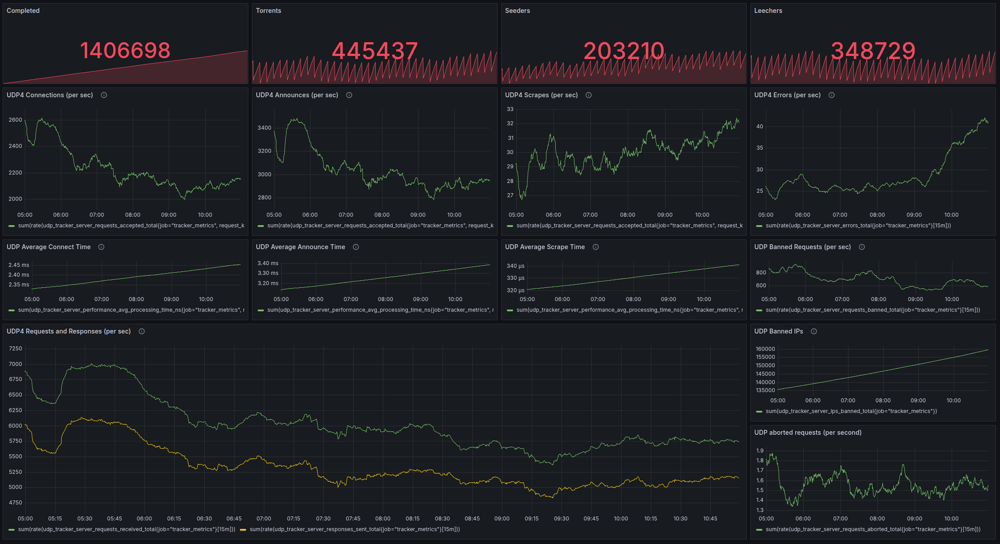

[](https://github.com/torrust/torrust-tracker-demo/actions/workflows/testing.yml)

# Torrust Tracker Demo

This repo contains all the configuration needed to run the live Torrust Tracker demo.

It's also used to track issues in production.

> IMPORTANT: We are in the process of [splitting the Torrust Demo repo into
> two repos](https://github.com/torrust/torrust-demo/issues/79). This will
> allow us to deploy both services independently and it would make easier for
> users who only want to setup the tracker to re-use this setup. The content
> of this repo may change drastically in the future.

## 🏗️ Repository Structure

This repository is organized into distinct concerns:

### 📦 [`infrastructure/`](infrastructure/)

**Server and system setup** - VMs, networking, operating system configuration

- OpenTofu/Terraform for VM provisioning
- cloud-init templates for system setup
- libvirt/KVM for local testing
- Infrastructure unit tests and validation

### 🚀 [`application/`](application/)

**Application deployment and configuration** - Docker services, app config

- Docker Compose for service orchestration
- Torrust Tracker configuration
- Nginx, Prometheus, Grafana setup
- Application scripts and utilities

### 🧪 [`tests/`](tests/)

**End-to-end testing** - Complete system validation

- E2E deployment workflow tests
- Integration testing automation
- System-wide validation

### 📚 [`docs/`](docs/)

**Project documentation** - Guides, security, and reference materials

- General project documentation
- Security and auditing information
- Cross-cutting concerns

## Demo Tracker

- **HTTP Tracker**: <https://tracker.torrust-demo.com/announce>
- **UDP Tracker**: udp://tracker.torrust-demo.com:6969/announce

For detailed information about all tracker ports and their specific purposes,
see [Application Port Documentation](application/docs/firewall-requirements.md#torrust-tracker-ports).

The demo includes monitoring with Grafana dashboards for performance metrics,
peer connections, and system health.



## 🚀 Quick Start

For detailed setup instructions, see the specific documentation:

- **Infrastructure**: [Infrastructure Quick Start](infrastructure/docs/quick-start.md)
- **Application**: [Application README](application/README.md)

### Complete Development Setup

```bash
# 1. Setup infrastructure dependencies
make dev-setup
# Log out and log back in for group permissions

# 2. Configure SSH key
make infra-config-local
# Edit infrastructure/terraform/local.tfvars with your SSH public key

# 3. Deploy VM and application
make infra-apply                                    # Deploy VM
make vm-ssh                                     # Access VM
docker compose -f application/compose.yaml up -d  # Deploy application
make infra-destroy                                 # Clean up
```

## 📚 Documentation

### Infrastructure Documentation

- [Infrastructure Quick Start](infrastructure/docs/quick-start.md) - Get started
  in 5 minutes
- [Complete Infrastructure Setup](infrastructure/docs/local-testing-setup.md) -
  Detailed guide
- [Infrastructure Overview](infrastructure/docs/infrastructure-overview.md) -
  Complete capabilities
- [libvirt Troubleshooting](infrastructure/docs/third-party/libvirt-setup.md) -
  Fix common issues

### Application Documentation

- [Application Overview](application/README.md) - Application components and
  deployment
- [Production Setup](application/docs/production-setup.md) - Production
  deployment with MySQL
- [Deployment Guide](application/docs/deployment.md) - Deployment procedures
- [Backup Procedures](application/docs/backups.md) - Data backup and recovery
- [Rollback Guide](application/docs/rollbacks.md) - Application rollbacks
- [Useful Commands](application/docs/useful-commands.md) - Common operations
- [Firewall Requirements](application/docs/firewall-requirements.md) - Network
  access requirements

### General Documentation

- [Documentation Structure](docs/README.md) - Cross-cutting documentation
- [Architecture Decisions](docs/adr/) - Design decisions and rationale
  - [ADR-001: Makefile Location](docs/adr/001-makefile-location.md) - Why the
    main Makefile is at repository root
  - [ADR-002: Docker for All Services](docs/adr/002-docker-for-all-services.md) -
    Why we use Docker for all services including UDP tracker
  - [ADR-003: Use MySQL Over MariaDB](docs/adr/003-use-mysql-over-mariadb.md) -
    Why we chose MySQL instead of MariaDB for the database backend

## 🛠️ Development

For contributors and developers:

- **Infrastructure development**: See [`infrastructure/README.md`](infrastructure/README.md)
- **Application development**: See [`application/README.md`](application/README.md)
- **General contributing guidelines**: See [`.github/copilot-instructions.md`](.github/copilot-instructions.md)
- **Architecture decisions**: See [`docs/adr/`](docs/adr/) for design rationale

### Code Quality and Linting

The project uses automated linting to ensure code quality and consistency:

```bash
# Run all linting checks
make lint

# Run individual linters (use script directly)
./scripts/lint.sh --yaml        # YAML files (yamllint)
./scripts/lint.sh --shell       # Shell scripts (shellcheck)
./scripts/lint.sh --markdown    # Markdown files (markdownlint)
```

**Required tools:**

- `yamllint` - YAML syntax and style checking
- `shellcheck` - Shell script analysis
- `markdownlint` - Markdown style and structure checking

**Installation:**

```bash
# Ubuntu/Debian
sudo apt-get install yamllint shellcheck
sudo npm install -g markdownlint-cli

# Or install all project dependencies
make install-deps
```

Linting is automatically run in CI/CD pipelines to validate all contributions.

> **Note**: The main `Makefile` is kept at the root level to serve as the
> project's primary interface. See [ADR-001](docs/adr/001-makefile-location.md)
> for the full rationale.
