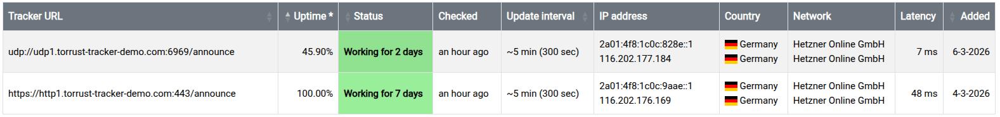
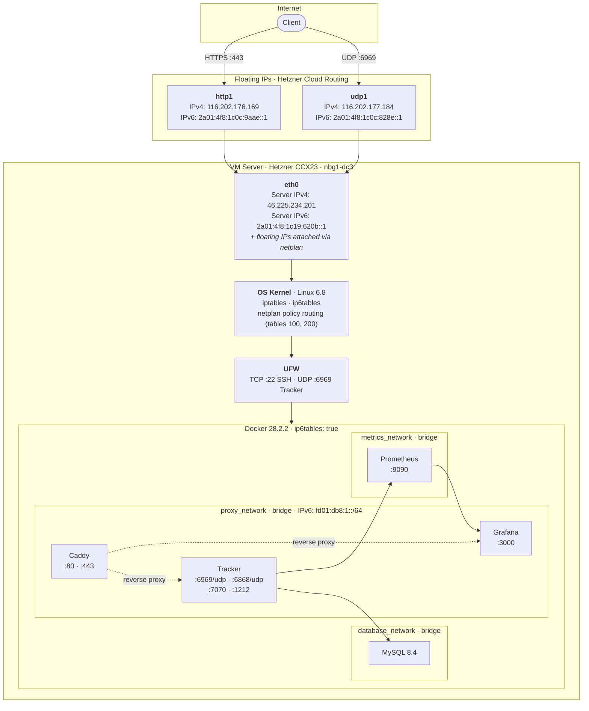
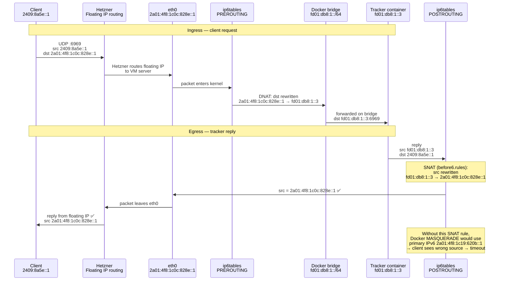

# Torrust Tracker Demo

[](https://github.com/torrust/torrust-tracker-demo/actions/workflows/linting.yml)

This repository contains the configuration needed to run the live
[Torrust Tracker](https://github.com/torrust/torrust-tracker) demo.

Live demo tracker endpoints:

- HTTP: <https://http1.torrust-tracker-demo.com:443/announce>
- UDP: `udp://udp1.torrust-tracker-demo.com:6969/announce`

> The tracker is listed on [newtrackon](https://newtrackon.com/) for public uptime tracking.



> **Note:** The low uptime shown for the UDP tracker (`udp1`) reflects the fact
> that it was added only 24 hours before this screenshot was taken, and there
> was an IPv6 routing misconfiguration during that period that prevented
> newtrackon from receiving responses. See the
> [post-mortem](docs/post-mortems/2026-03-09-udp-ipv6-docker.md) for details.
> Uptime figures should also be read in the context of server size and request
> load — a tracker running on a small server that is receiving more requests
> than it can handle will report low uptime even if the software itself is
> healthy. See [docs/infrastructure.md](docs/infrastructure.md) for the exact
> server specification used in this demo.

## Background

[Torrust](https://github.com/torrust) is an open-source organization building
BitTorrent tools in Rust. Our two main projects are:

- **[Torrust Tracker](https://github.com/torrust/torrust-tracker)** — a
  feature-complete BitTorrent tracker (UDP + HTTP, IPv4 + IPv6).
- **[Torrust Index](https://github.com/torrust/torrust-index)** — a BitTorrent
  index (think: a self-hosted torrent site). It integrates with the tracker to
  automatically embed the tracker URL into uploaded torrents.

We have been running a combined live demo of both services since **April 24,
2024**, available at <https://index.torrust-demo.com>. That demo serves as a
reference deployment and a public integration test for the two applications
working together.

### Why this repo exists

The original demo lived in a single repository:
[torrust/torrust-demo](https://github.com/torrust/torrust-demo).

After running the combined demo for a while, we decided to split it into two
separate repositories
([torrust-demo#79](https://github.com/torrust/torrust-demo/issues/79)):

- **[torrust/torrust-tracker-demo](https://github.com/torrust/torrust-tracker-demo)**
  — this repository (tracker only).
- **torrust/torrust-index-demo** — the index demo (coming soon).

Reasons for the split:

- **Independent deployability** — the tracker and index can be deployed,
  updated, and scaled separately.
- **Independent teams** — different maintainers can own each demo without
  stepping on each other.
- **Independent scaling** — tracker and index have very different traffic
  patterns and resource needs.
- **Tracker-only users** — many users only need a tracker. Keeping tracker
  configuration separate makes it easier to adopt.

## Purpose of this repository

- **Share the demo configuration** — so that others can replicate the setup
  for their own deployments.
- **Track production issues** — issues raised here correspond to problems or
  improvements observed in the live demo environment.
- **Document deployment** — we believe there is a significant lack of
  practical documentation on how to deploy and operate BitTorrent tools. This
  repo is part of our effort to fix that.

## Demo details

| Property      | Value                                                                 |
| ------------- | --------------------------------------------------------------------- |
| Running since | March 3, 2026                                                         |
| Database      | MySQL                                                                 |
| IP support    | IPv4 + IPv6                                                           |
| Hosting       | [Hetzner](https://www.hetzner.com/)                                   |
| Monitoring    | Grafana (dashboards for peer connections, performance, system health) |

The new tracker uses **MySQL** (the original combined demo used SQLite) and
supports both **IPv4 and IPv6**.

The server was provisioned using
[torrust-tracker-deployer](https://github.com/torrust/torrust-tracker-deployer).
Some features (floating IP routing, Docker IPv6) require
[manual post-deployment steps](docs/post-deployment.md) not covered by the deployer.

## Architecture

The diagram below shows the three levels of network isolation (floating IPs,
server IPs, Docker networking), the software components involved in packet
handling (OS kernel, UFW, Docker), and all real IPv4/IPv6 addresses.

<!-- cspell:disable -->


```mermaid
flowchart TB
    subgraph internet["Internet"]
        client(["Client"])
    end

    subgraph hetzner["Floating IPs · Hetzner Cloud Routing"]
        direction LR
        http1["<b>http1</b><br/>IPv4: 116.202.176.169<br/>IPv6: 2a01:4f8:1c0c:9aae::1"]
        udp1["<b>udp1</b><br/>IPv4: 116.202.177.184<br/>IPv6: 2a01:4f8:1c0c:828e::1"]
    end

    subgraph vm["VM Server · Hetzner CCX23 · nbg1-dc3"]
        eth0["<b>eth0</b><br/>Server IPv4: 46.225.234.201<br/>Server IPv6: 2a01:4f8:1c19:620b::1<br/><i>+ floating IPs attached via netplan</i>"]

        kernel["<b>OS Kernel</b> · Linux 6.8<br/>iptables · ip6tables<br/>netplan policy routing (tables 100, 200)"]

        ufw["<b>UFW</b><br/>TCP :22 SSH · UDP :6969 Tracker"]

        subgraph docker["Docker 28.2.2 · ip6tables: true"]
            subgraph proxynet["proxy_network · bridge · IPv6: fd01:db8:1::/64"]
                caddy["Caddy<br/>:80 · :443"]
                tracker["Tracker<br/>:6969/udp · :6868/udp<br/>:7070 · :1212"]
                grafana["Grafana<br/>:3000"]
            end

            subgraph dbnet["database_network · bridge"]
                mysql["MySQL 8.4"]
            end

            subgraph metricsnet["metrics_network · bridge"]
                prom["Prometheus<br/>:9090"]
            end
        end
    end

    client -- "HTTPS :443" --> http1
    client -- "UDP :6969" --> udp1
    http1 --> eth0
    udp1 --> eth0
    eth0 --> kernel
    kernel --> ufw
    ufw --> docker

    caddy -. "reverse proxy" .-> tracker
    caddy -. "reverse proxy" .-> grafana
    tracker --> mysql
    tracker --> prom
    prom --> grafana
```

<!-- cspell:enable -->

### IPv6 UDP Packet Flow

The trickiest traffic path is a native IPv6 UDP announce. The sequence below
shows every hop and address rewrite between the client and the tracker
container, including the DNAT on ingress and the SNAT on egress that keeps the
reply source equal to the floating IP the client originally contacted.

<!-- cspell:disable -->


```mermaid
sequenceDiagram
    participant C as Client<br/>2409:8a5e::1
    participant H as Hetzner<br/>Floating IP routing
    participant E as eth0<br/>2a01:4f8:1c0c:828e::1
    participant PRE as ip6tables<br/>PREROUTING
    participant BR as Docker bridge<br/>fd01:db8:1::/64
    participant T as Tracker container<br/>fd01:db8:1::3
    participant POST as ip6tables<br/>POSTROUTING

    Note over C,T: Ingress — client request
    C->>H: UDP :6969<br/>src 2409:8a5e::1<br/>dst 2a01:4f8:1c0c:828e::1
    H->>E: Hetzner routes floating IP<br/>to VM server
    E->>PRE: packet enters kernel
    PRE->>BR: DNAT: dst rewritten<br/>2a01:4f8:1c0c:828e::1 → fd01:db8:1::3
    BR->>T: forwarded on bridge<br/>dst fd01:db8:1::3:6969

    Note over C,T: Egress — tracker reply
    T->>POST: reply<br/>src fd01:db8:1::3<br/>dst 2409:8a5e::1
    Note over POST: SNAT (before6.rules):<br/>src rewritten<br/>fd01:db8:1::3 → 2a01:4f8:1c0c:828e::1
    POST->>E: src = 2a01:4f8:1c0c:828e::1 ✅
    E->>H: packet leaves eth0
    H->>C: reply from floating IP ✅<br/>src 2a01:4f8:1c0c:828e::1

    Note over POST: Without this SNAT rule,<br/>Docker MASQUERADE would use<br/>primary IPv6 2a01:4f8:1c19:620b::1<br/>→ client sees wrong source → timeout
```

<!-- cspell:enable -->

For the full explanation of why both `ip6tables: true` in the Docker daemon and
the SNAT rule in `before6.rules` are required, see
[docs/docker-ipv6.md](docs/docker-ipv6.md). For full IP and DNS tables, see
[docs/infrastructure.md](docs/infrastructure.md).

## Related projects

| Repository                                                                              | Description                                    |
| --------------------------------------------------------------------------------------- | ---------------------------------------------- |
| [torrust/torrust-tracker](https://github.com/torrust/torrust-tracker)                   | The tracker software itself                    |
| [torrust/torrust-index](https://github.com/torrust/torrust-index)                       | The index software                             |
| [torrust/torrust-demo](https://github.com/torrust/torrust-demo)                         | Original combined demo (Index + Tracker)       |
| [torrust/torrust-tracker-deployer](https://github.com/torrust/torrust-tracker-deployer) | Deployment tooling used to provision this demo |

## Linting

This project uses [torrust-linting](https://crates.io/crates/torrust-linting)
as a unified linter for Markdown, YAML, spell checking, and shell scripts.
A CI workflow runs all linters automatically on every push and pull request.

### Install the linter

```sh
cargo install torrust-linting --locked
```

This installs a binary called `linter` on your `$PATH`.

### Run linters locally

```sh
./scripts/lint.sh
```

This runs markdown, YAML, spell check, and shell script linters in sequence.

> **Note:** Do not run `linter all` — this repo is not a Rust project, so the
> Rust-specific linters (clippy, rustfmt) will fail.

Add any new project-specific words to `project-words.txt` (one word per line)
to suppress false positives from the spell checker.

## Contributing

Feedback, issues, and pull requests are welcome. If you spot a problem with the
live demo or have a suggestion for improving the configuration or documentation,
please [open an issue](https://github.com/torrust/torrust-tracker-demo/issues).
