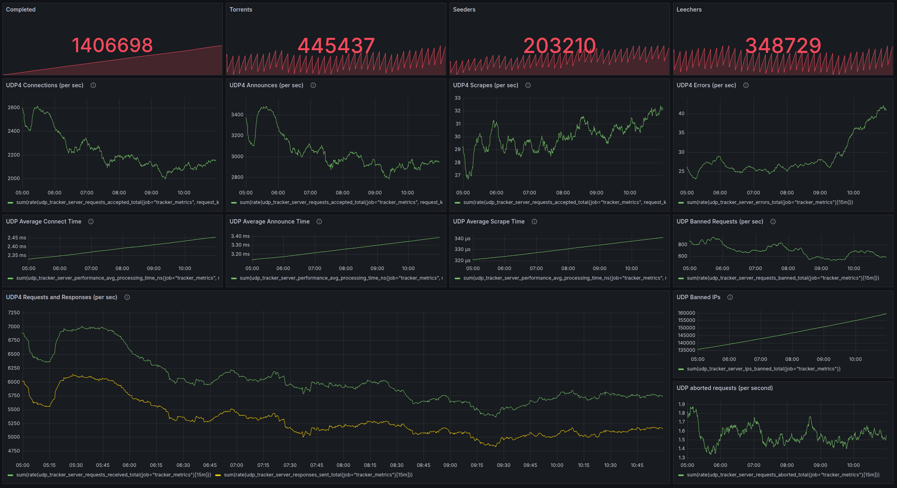

# Application

This directory contains all application-related components for the Torrust
Tracker Demo project - everything needed to deploy, configure, and manage the
Torrust Tracker application itself.

## 🚀 Structure

```text
application/
├── docs/                      # Application documentation
│   ├── production-setup.md    # Production deployment guide
│   ├── deployment.md          # Deployment procedures
│   ├── backups.md            # Application backup procedures
│   ├── rollbacks.md          # Application rollback procedures
│   ├── useful-commands.md     # Common application commands
│   ├── firewall-requirements.md # Network access requirements
│   └── media/                # Application-specific images and diagrams
│       ├── torrust-tracker-grafana-dashboard.png
│       └── do-firewall-configuration.png
├── share/                     # Application resources
│   ├── bin/                  # Deployment and utility scripts
│   │   ├── deploy-torrust-tracker-demo.com.sh
│   │   ├── install.sh
│   │   ├── ssl_renew.sh
│   │   ├── time-running.sh
│   │   ├── tracker-db-backup.sh
│   │   └── tracker-filtered-logs.sh
│   ├── container/default/config/  # Container configurations
│   │   ├── crontab.conf
│   │   ├── nginx.conf
│   │   ├── prometheus.yml
│   │   └── tracker.prod.container.sqlite3.toml
│   ├── dev/home/             # Development configurations
│   └── grafana/dashboards/   # Grafana dashboard configurations
│       ├── metrics.json
│       ├── stats.json
│       └── README.md
├── compose.yaml              # Docker Compose configuration
├── .env.production          # Production environment variables
└── README.md               # This file
```

## 🎯 Purpose

### Application Concerns

- **Service Deployment**: Torrust Tracker, Nginx, Prometheus, Grafana
- **Application Configuration**: Tracker settings, database connections
- **Service Orchestration**: Docker Compose service management
- **Application Data**: Database, logs, metrics, dashboards
- **Application Security**: SSL certificates, service authentication
- **Application Monitoring**: Metrics collection, alerting, dashboards

### Technologies Used

- **Docker & Docker Compose**: Container orchestration
- **Torrust Tracker**: The main BitTorrent tracker application
- **Nginx**: Reverse proxy and SSL termination
- **Prometheus**: Metrics collection and storage
- **Grafana**: Metrics visualization and dashboards
- **MySQL**: Database (migrating from SQLite)
- **Certbot**: SSL certificate management

## 🚀 Quick Start

### Application Deployment

```bash
# Deploy application services
docker compose -f application/compose.yaml up -d

# Check service status
docker compose -f application/compose.yaml ps

# View logs
docker compose -f application/compose.yaml logs -f
```

### Full Infrastructure + Application Testing

```bash
# 1. Setup infrastructure (from repository root)
make dev-setup
# Log out and log back in for permissions

# 2. Configure SSH key
make setup-ssh-key
# Edit infrastructure/terraform/local.tfvars with your SSH public key

# 3. Deploy VM and application
make apply                                    # Deploy VM
make ssh                                     # Access VM
docker compose -f application/compose.yaml up -d  # Deploy application
make destroy                                 # Clean up
```

### Demo Tracker URLs

Once deployed, the tracker is available at:

- **HTTP Tracker**: <https://tracker.torrust-demo.com/announce>
- **UDP Tracker**: udp://tracker.torrust-demo.com:6969/announce

For detailed information about all tracker ports and their purposes,
see [Port Documentation](docs/firewall-requirements.md#torrust-tracker-ports).

### Monitoring Dashboard

The demo includes comprehensive monitoring with Grafana dashboards:



## 📋 What Application Provides

### Core Services

- **Torrust Tracker**: BitTorrent tracker with HTTP and UDP support
- **Web Interface**: Management and monitoring interface
- **API Endpoints**: REST API for tracker management
- **Metrics Collection**: Prometheus metrics for monitoring
- **Visualization**: Grafana dashboards for analytics

### Support Services

- **Reverse Proxy**: Nginx for SSL termination and routing
- **SSL Certificates**: Automated certificate management
- **Log Management**: Centralized logging and filtering
- **Backup System**: Database and configuration backups
- **Health Monitoring**: Service health checks and alerting

## 🔧 Application vs Infrastructure

This directory focuses on **application** concerns. For **infrastructure**
concerns (VMs, networking, system setup), see the
[`../infrastructure/`](../infrastructure/) directory.

**Application = "What runs and how it's configured"**  
**Infrastructure = "Where and how the application runs"**

## 🔄 Deployment Workflow

### Development

1. **Infrastructure**: Use `make apply` to provision VM
2. **Application**: Deploy services with Docker Compose
3. **Testing**: Run integration tests
4. **Iteration**: Make changes and repeat

### Production

1. **Infrastructure**: Provision Hetzner servers
2. **Application**: Deploy using production configuration
3. **Monitoring**: Enable metrics and alerting
4. **Maintenance**: Automated backups and updates

## 📊 Monitoring and Observability

- **Metrics**: Prometheus scrapes application metrics
- **Dashboards**: Grafana provides visualization
- **Logs**: Centralized logging with filtering
- **Health Checks**: Service availability monitoring
- **Alerts**: Notification system for issues

## 🔒 Security

- **SSL/TLS**: Automatic certificate management
- **Service Isolation**: Container-based security
- **Access Control**: Authentication and authorization
- **Data Protection**: Encrypted data at rest and in transit

## 📚 Documentation

### Application Guides

- [Production Setup](docs/production-setup.md) - Production deployment
- [Deployment Procedures](docs/deployment.md) - Step-by-step deployment
- [Backup Procedures](docs/backups.md) - Data backup and recovery
- [Rollback Procedures](docs/rollbacks.md) - Application rollback procedures
- [Useful Commands](docs/useful-commands.md) - Common operations and commands
- [Firewall Requirements](docs/firewall-requirements.md) - Network access needs

### Contributing to Application Documentation

When adding application documentation:

- **Application docs**: Docker, services, deployment, operations, configuration
- **Keep it practical**: Focus on deployment, configuration, and operations
- **Include examples**: Provide working command examples
- **Test procedures**: Document testing and validation steps
- **Cross-reference**: Link to related application documentation

### Application vs Infrastructure Separation

Application = "What runs and how it's configured"

Application documentation should cover:

- Docker Compose service configuration
- Application deployment procedures
- Service-level monitoring and logging
- Application backup and recovery
- SSL certificate management
- Application-specific troubleshooting

See [`../infrastructure/`](../infrastructure/) for infrastructure-specific documentation.
