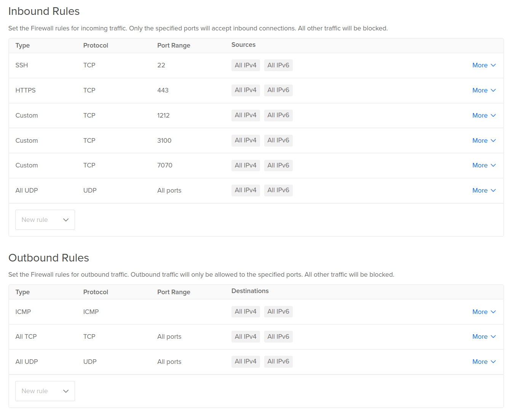

# Firewall Requirements

This document specifies the network access requirements for the Torrust Tracker
application components. These requirements should be implemented at the
infrastructure level (cloud firewall, UFW, iptables, etc.).

## Required Ports

### Public Access (Internet-facing)

| Port | Protocol | Service | Purpose                           | Required |
| ---- | -------- | ------- | --------------------------------- | -------- |
| 22   | TCP      | SSH     | Server administration             | Yes      |
| 80   | TCP      | HTTP    | Let's Encrypt challenges          | Temp\*   |
| 443  | TCP      | HTTPS   | Web interface & API               | Yes      |
| 6868 | UDP      | Tracker | Internal testing UDP tracker      | Yes      |
| 6969 | UDP      | Tracker | Official public UDP tracker       | Yes      |
| 7070 | TCP      | Tracker | Internal HTTP tracker (via Nginx) | Yes      |

\*Port 80 only needs to be temporarily enabled during SSL certificate generation.

### Internal Access (Server-local only)

| Port | Protocol | Service    | Purpose                | Access |
| ---- | -------- | ---------- | ---------------------- | ------ |
| 1212 | TCP      | Tracker    | API & metrics endpoint | Local  |
| 3100 | TCP      | Grafana    | Dashboard interface    | Local  |
| 9090 | TCP      | Prometheus | Metrics collection     | Local  |

## Security Requirements

### Critical: Internal Services Must Not Be Exposed

- **Prometheus (port 9090)**: No authentication - must be internal only
- **Grafana (port 3100)**: Contains sensitive metrics - internal only
- **Tracker metrics (port 1212)**: Internal monitoring data

### SSL/TLS Requirements

- **HTTPS (port 443)**: Must use valid SSL certificates
- **HTTP (port 80)**: Only for Let's Encrypt ACME challenges
- **Tracker UDP**: No encryption (BitTorrent protocol limitation)
- **Tracker HTTP**: Should use HTTPS in production

## Implementation Examples

The infrastructure should implement these requirements. Common implementations:

### Cloud Firewalls (Hetzner, AWS, etc.)

```yaml
# Allow only required external ports
# Block all internal ports from external access
```

### UFW (Ubuntu Firewall)

```bash
# Example commands (infrastructure will implement)
ufw allow 22/tcp
ufw allow 443/tcp
ufw allow 6868/udp
ufw allow 6969/udp
ufw allow 7070/tcp
# Internal ports: no external access
```



## Application Service Mapping

### Torrust Tracker Ports

The tracker uses four main ports, each serving a specific purpose:

#### UDP Tracker Ports

- **Port 6868 (UDP)**: Internal testing UDP tracker

  - Not listed on public tracker lists (like [newtrackon.org](https://newtrackon.com/))
  - Used for internal testing and development
  - Provides an alternative UDP endpoint when port 6969 is under heavy load
  - Guarantees developers can make requests without timeouts due to socket saturation

- **Port 6969 (UDP)**: Official public UDP tracker
  - The primary UDP tracker port listed on public tracker lists
  - Always under heavy usage in production
  - Standard BitTorrent UDP announce endpoint
  - Used by torrent clients for tracker communication

#### HTTP/HTTPS Tracker Ports

- **Port 7070 (TCP)**: Internal HTTP tracker
  - HTTP-only tracker endpoint (no HTTPS)
  - Not directly accessible from the internet (internal/private network only)
  - Accessed internally through Nginx reverse proxy
  - Nginx provides HTTPS termination and certificate management
  - Used for HTTP-based tracker announces

#### API and Metrics

- **Port 1212 (TCP)**: Tracker API and metrics
  - Used internally (private network) between Nginx proxy and tracker service
  - Exposed publicly through Nginx proxy at `https://tracker.torrust-demo.com/api/...`
  - Main endpoint: `/api/v1/stats` for Prometheus metrics (with token authentication)
  - Additional endpoints available for manual requests:
    - `/api/v1/torrents` - List of torrents
    - `/api/v1/torrent/{info_hash}` - Torrent details
    - `/api/v1/metrics` - Prometheus metrics
  - Used by Prometheus for monitoring and Grafana dashboards

### Application Service Mapping

### Torrust Tracker

- **UDP ports 6868, 6969**: BitTorrent announce endpoints
- **TCP port 7070**: HTTP announce (internal, accessed via Nginx proxy)
- **TCP port 1212**: API and metrics (internal, accessed via Nginx proxy)

### Nginx Reverse Proxy

- **TCP port 443**: HTTPS termination and routing
- **TCP port 80**: Let's Encrypt challenges only

### Monitoring Stack

- **Prometheus (9090)**: Metrics collection (internal only)
- **Grafana (3100)**: Dashboards (internal only)

## Security Notes

1. **Never expose Prometheus** - it has no authentication
2. **Grafana access** - should be accessed via SSH tunnel or VPN
3. **Regular certificate renewal** - may require temporary port 80 access
4. **Monitor access logs** - watch for unauthorized access attempts

For infrastructure-specific firewall implementation guides, see the
infrastructure documentation.
